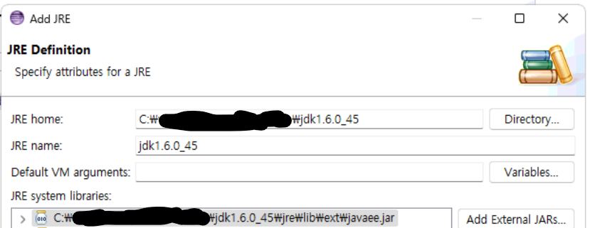
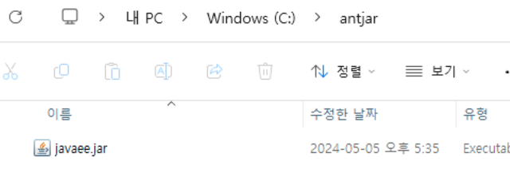

## 트러블슈팅 소개

제가 맡는 서비스 중에서 빌드 도구는 Ant를 사용하는 프로젝트가 있습니다.

> 여기서 프로젝트란 개발자가 만드는 하나의 프로그램 단위를 뜻합니다.

해당하는 Java 파일을 Ant 도구를 이용하여 컴파일 & 빌드를 하려다가 라이브러리를 못 찾는다는 에러가 발생해 이를 해결하는 과정에 대해 소개합니다.

## 이상하다… 예전에 환경 설정하고서 실행할 때는 잘 됐는데?

### 잘 됐는데요. 잘 안 됐습니다.

요구사항이 생겨 수정 후 Ant 빌드를 했는데 아래와 같은 오류들이 발생했습니다.

```ini
Buildfile: C:\work\working\project\build\a_domain\build_domain.xml
delete_bin:
compile:
    [javac] Compiling 24 source files to C:\work\working\project\bin
    [javac] C:\work\working\project\src\a_domain\common\session\EContext.java:3: package javax.ejb does not exist
    [javac] import javax.ejb.*;
    [javac] ^
    [javac] C:\work\working\project\src\a_domain\common\session\EJBSession.java:5: package javax.ejb does not exist
    [javac] import javax.ejb.*;
    [javac] ^
    [javac] C:\work\working\project\src\a_domain\common\session\EJBSession.java:24: cannot find symbol
    [javac] symbol: class SessionBean
    [javac] public class EJBSession implements SessionBean
    [javac]                                      ^

... 이하 생략
```

모두 참조할 클래스를 찾을 수 없다는 오류들이었습니다.


그래서 먼저 Ant 빌드가 어떻게 일어나는지 어느 부분에서 파일을 못 찾는다는 건지 알아내고자 디버깅을 했습니다.

먼저, 정상적으로 빌드가 성공했을 때는 다음의 과정으로 이루어집니다.

1. 해당 xml과 연관된 bin 폴더 내 class, xml 파일 삭제
2. 컴파일
3. META-INF 폴더에 관련된 xml 파일 복사
  
   (1). Java 애플리케이션에서 사용되는 메타 데이터를 설정 정보를 저장하는 폴더인 META-INF에다가 xml 파일로 복사
4. 빌드

   (1). jar 파일 생성

```ini
Buildfile: C:\work\working\project\build\a_domain\build_domain.xml
delete_bin:
   [delete] Deleting C:\work\working\project\bin\META-INF\ejb-jar.xml
   [delete] Deleting C:\work\working\project\bin\a_domain\admin\EJBAdmin.class
   [delete] Deleting C:\work\working\project\bin\a_domain\common\error\EJBErrorCode.class
   [delete] Deleting C:\work\working\project\bin\a_domain\common\db\EJBDBManager.class
   [delete] Deleting C:\work\working\project\bin\a_domain\ejb\code\EVCodeHome.class
   [delete] Deleting C:\work\working\project\bin\a_domain\ejb\user\EJBHome.class
compile:
    [javac] Compiling 24 source files to C:\work\working\project\bin
meta_inf_copy:
     [copy] Copying 2 files to C:\work\working\project\bin\META-INF
jars:
   [delete] Deleting: C:\work\working\project\bin\jar\a_domain\a_domain_user.jar
      [jar] Building jar: C:\work\working\project\bin\jar\a_domain\a_domain_user.jar
start.copy:
     [copy] Copying 1 file to C:\work\working\person_Hr\jar\a_domain
auto.copy:
     [echo] Application Name:a_domain_user.jar
     [copy] Copying 1 file to C:\Oracle\Middleware\Oracle_Home\...\autodeploy
BUILD SUCCESSFUL
Total time: 1 second
```

그러나 디버깅을 했을 때는 위 과정 중 컴파일 부분에서 오류가 발생한 것이었습니다.
컴파일 부분에 쓰인 옵션을 살펴봤을 때는 classpath 옵션이 제일 유력하여 이를 중심으로 문제를 해결하고자 했습니다.


## 시도했던 삽질들

### 삽질 1 : jar 추가와 개발환경 다시 구축

처음에는 WAS에서 등록했던 jar 파일 중에 누락이 있던 건가? 싶어 jar 추가도 해보고, 구성했던 개발환경을 다시 구축해봤습니다.

그러나 누락된 jar 파일도 없었고, 개발환경을 다시 구축한다 한들, 프로그램을 지우고 다시 설치하는 과정 자체는 클래스를 못 찾는 에러와는 다른 문제였기에 빌드는 여전히 제 기능을 못 하고 있었습니다.

### 삽질 2 : Build Path 속성에다가 jar 파일 바라보도록 설정하기

프로젝트 설정에서 jar를 직접 추가해서 가지고 오면 되겠다 싶어 프로젝트의 Properties - Java Build Path로 Libraries 폴더로 들어갔을 때는 파일을 가져올 수 없다는 뜻의 `missing`이 표시되어있었습니다.


사진은 Order and Export 탭이 켜져 있지만 Libraries에 추가한 파일/폴더를 추가하면 이 탭에서도 똑같이 조회가 가능합니다.


설정을 통해 jar를 추가하면 프로젝트에서 설정된 클래스패스를 xml로 남겨놓는 `.classpath` 파일에도 추가됩니다.

```xml
<classpath>
	...
	<classpathentry kind="lib" path="C:/work/working/a_domain/web/WEB-INF/lib/javaee.jar"/>
	...
	<classpathentry kind="output" path="web/WEB-INF/classes"/>
</classpath>
```


기존 프로젝트 폴더의 WEB-INF/lib에 있는 jar 파일을 `Add JARs`, `Add External JARs` 두 방식을 동시에 사용하여 가져와보기도 하고, 둘 중 하나의 방식으로도 가져오려고 시도했지만 안 되는 건 마찬가지였습니다.
- `Add JARs` : 프로젝트 내에 있는 JAR 파일 가져오기
- `Add External JARs` : 프로젝트 외부에 있는 JAR 파일 가져오기

### 삽질 3 : properties 파일에 직접 경로를 하드코딩하기

```properties
classpath.compile=${classpath};C:\...\web\WEB-INF\lib\javaee.jar;
```
```xml
<target name="compile">
	<javac srcdir="${src.dir}" destdir="${build.dir}"
		...
		classpath="${classpath.compile}">
	</javac>
</target>
```

properties 파일에서 해당 jar의 전체 경로 `C:\...\web\WEB-INF\lib\javaee.jar`를 읽어오도록 유도해봤지만 역시 실패했습니다.


### 삽질 4 : build할 xml 파일의 classpath에 참조 방식으로 걸어주기

```xml
<target name="compile">
	<javac srcdir="${src.dir}" destdir="${build.dir}"
		...
		classpath="${classpath.compile};${javaee.jar}">
	</javac>
</target>
```


> classpath="${classpath.compile}" 부분에서 ${javaee.jar}도 참조를 걸어줍니다.

`${javaee.jar}`는 properties 파일에 미리 경로를 걸어주고 classpath에 추가해주면 될 줄 알았지만 실패했습니다.

분명 같은 경로를 참조할텐데 말이죠.


## 해결했던 방법, 과정

### 해결 과정 1 : xml 파일에서 classpath에 jar 전체 경로를 하드코딩하기

<!-- 컴파일 타겟 -->
<target name="compile" depends="delete_bin">
	<javac srcdir="${src.dir}" destdir="${build.dir}"
		...
		classpath="${classpath.compile};C:\...\web\WEB-INF\lib\javaee.jar;">
	</javac>
</target>

`삽질 4`에서 했던 방식이랑 거의 같지만, 해결했던 방식 첫 번째는 전체 경로를 **하드코딩**하는 것이었습니다.

하지만 **10개가 넘는 기능들의 xml 파일에 일일이 저렇게 경로를 넣어주는 건** 비효율적인 방법이라고 생각해서 더 나은 방법이 있나 찾아봤습니다.


### 해결 과정 2 : 이 프로젝트가 의존 중인 JDK의 jre/lib폴더에다가 jar 파일 직접 넣기


Java로 실행하는 프로그램은 무조건 JVM 위에서 실행되어야 합니다. JVM이 있다는 것은 곧 설정된 JDK 혹은 JRE에 영향을 받는다는 것입니다.

Ant 빌드를 할 때도 Java 파일을 컴파일하고 jar를 만드는 과정에서 JVM 환경이 필요하기에, JDK 안에 있는 jre/lib 경로에 해당 jar 파일을 넣어서 JRE 환경을 세팅했습니다.


> 이클립스 - Ant Build할 xml 우클릭 - External Tools Configuration 혹은 두 번째 Ant Build 메뉴



JDK를 추가했는데도 jar가 추가되지 않아 `Add External JARs` 메뉴로 추가했습니다.


### 해결 과정 3 : web/WEB-INF/lib 까지의 폴더 경로를 상대경로로 설정

```properties
lib=C:/.../web/WEB-INF/lib
```

기존에는 절대 경로로 파일을 찾는 방식이었다면

```properties
lib=../../web/WEB-INF/lib
```

상위 디렉토리들을 거쳐 원하는 폴더를 참조하도록 설정했습니다.


하지만 이런 방식은 프로젝트의 위치가 달라져도 참조할 수 있지만, 다른 사람이 봤을 때 매번 폴더가 어디인지 찾아가는 불편함이 있습니다.

절대경로도 구조가 달라지면 익스플로러 폴더 찾아가서 경로를 구해 수정하는 작업이 필요할 수 있고 오타도 발생할 수 있어, 절대경로/상대경로의 불편함에 대해서는 개인차가 있겠다 생각이 듭니다.


### 해결 과정 4 : Path 데이터타입 추가

```xml
<path id="compile.classpath">
	<!-- 1번째 방식 -->
	<pathelement location="${javaee.jar}"/>
	
	<!-- 2번째 방식 -->
	<pathelement path="${javaee.jar}" />
	
	<!-- 3번째 방식 -->
	<fileset dir="${lib}">
		<include name="*.jar" />
	</fileset>
</path>

<target name="compile">
	<javac srcdir="${src.dir}" destdir="${build.dir}" ...>
		<classpath refid="compile.classpath" />
	</javac>
</target>
```

여러 작업에 대해 동일한 경로 구조를 사용하는 경우 태스크를 수행하는 `<target>`과 동일한 수준에서 `<path>`요소를 사용하여 정의하고 해당 id 속성을 통해 참조할 수 있습니다. 

location 애트리뷰트로 위의 예시처럼 jar 파일 한 개씩 참조하도록 지정했습니다.

location 말고도 path로도 처리할 수 있고, `<pathelement>` 대신 `<fileset>`을 이용하여 원하는 경로에 있는 jar를 참조시킬 수도 있었습니다.


### 해결 과정 5 : 임의의 폴더를 만들어 절대경로로 설정



다음과 같이 임의로 만든 파일에 jar를 넣고 그 경로를 properties에 추가합니다.

```properties
#javaee jar 파일 경로
javaee.jar = C:/folder/javaee.jar
```


이 경로를 javac 태스크의 classpath 옵션에 추가해줍니다.

```xml
<target name="compile">
	<javac srcdir="${src.dir}" destdir="${build.dir}"
		...
		classpath="...;${javaee.jar}">
	</javac>
</target>
```

이 방법이 되었을 때는 잠시 web/WEB-INF 폴더부터는 접근이 제한되기 때문에 절대경로를 통해서는 접근이 안 되고, 상대경로를 통하면 프로젝트 내에서 참조하는 거라서 되는 건가? 라는 생각을 했었습니다.

하지만 WEB-INF가 무조건 접근이 안 되는 건 아니었습니다. WEB-INF의 접근을 막는 톰캣에서는 `설정파일이 많이 있는` WEB-INF폴더를 보안상의 이유로 보호하자는 뜻에서 접근을 제한한 거고, 이 프로젝트의 WAS인 WebLogic에서는 따로 설정을 해줘야 합니다. 


### 해결 과정 6 : 오타 발견

참조했어야 했던 경로
```properties
web=C:/work/working/a_domain/web
```

기존에 설정되어있던 경로
```properties
web=C:/working/working/a_domain/web
```

`work` 와 `working`은 다른 이름입니다. 이 간소한 차이를 두고 그 경로를 계속 참조하려고 시도했던 것이었습니다.

> 이때, properties에 경로를 지정할 때는 포워드 슬래시`/`로 경로를 구분해줘야 합니다. 백 슬래시`\`로 하면 경로가 묵사발이 되어서 각 경로 이름들이 붙습니다.

```ini
# 백 슬래시 \ 로 구분했을 때
BUILD FAILED
C:\work\working\project\build\a_domain\build_domain.xml:25: C:\work\working\project\build\a_domain\workworkinga_domainweb\WEB-INF\lib does not exist.

Total time: 192 milliseconds
```


## 결국 원인은 오타였습니다

### 오타로 인해 이미 가능한 방법이었던 삽질들
- 삽질 1 : jar 추가와 개발환경 다시 구축
  - properties에 있던 경로가 제대로 맞춰져 있었다면 바로 되었을 겁니다.
  - 담당하는 서비스는 이미 환경설정이 되어있는 것을 압축해놓고 메뉴얼에 맞게 풀어서 쓰는 방식이라, 엉뚱한 경로에 구축을 하지 않는 이상 안 될 수는 없었습니다.
- 삽질 3 : properties 파일에 직접 경로를 하드코딩하기
  - `/`로 경로를 구분해놓고 정상적인 경로를 집어넣었다면 가능한 방법이었습니다.
- 삽질 4 : build할 xml 파일의 classpath에 참조 방식으로 걸어주기
  - 삽질 3과 마찬가지로 정상적인 경로를 집어넣었다면 가능한 방법이었습니다.

### 이를 통해서 느꼈던 점들이 있었어요
- 실무를 하면서 환경설정 관련 이슈는 꼭 **메뉴얼**을 만들어두자
  - 제가 담당하고 있는 서비스에는 대부분 명세화가 잘 안 되어있던 상태였습니다.
- 문제를 파악할 때 자신만의 체계를 두거나 좋은 Practice가 있다면 그를 토대로 트러블슈팅을 해나가자
  - 오류의 내용, 설정 상태 등을 **차분하게** 읽어나간다면, 기존에 되던 상태와의 차이점이 무엇인지 더 빨리 찾을 수 있지 않았을까 하는 생각이 들었습니다.


## References
- Ant 개요 및 대략적인 사용법
  - https://cheershennah.tistory.com/192
- 1.8.4 버전 메뉴얼 참고
  - https://archive.apache.org/dist/ant/manual/
- classpath 참고
  - https://effectivesquid.tistory.com/entry/%EC%9E%90%EB%B0%94-%ED%81%B4%EB%9E%98%EC%8A%A4%ED%8C%A8%EC%8A%A4classpath%EB%9E%80
- Ant 빌드의 기능 및 classpath 등 참고
  - https://2734.tistory.com/139
  - 자바의 또 다른 멋진 도구 Ant 2, 3, 5 장, 저자 : 에릭 해쳐, 스트브 라우란 
- 갑자기 Ant 빌드가 안 된다면
  - https://blog.naver.com/j_hyoungbae/110085263326
- 외부 라이브러리 파일 등록
  - https://codevang.tistory.com/190#google_vignette
- 웹로직
  - https://m.cafe.daum.net/javadoc/I4Sf/6?listURI=%2Fjavadoc%2F_rec