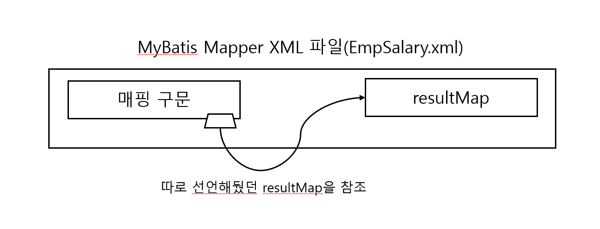
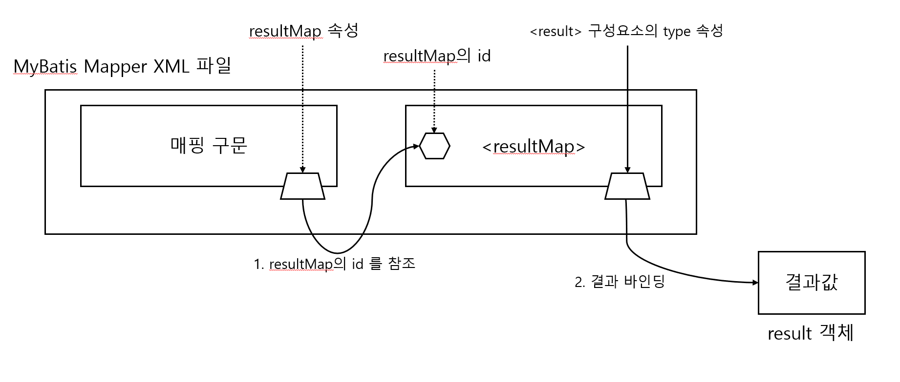
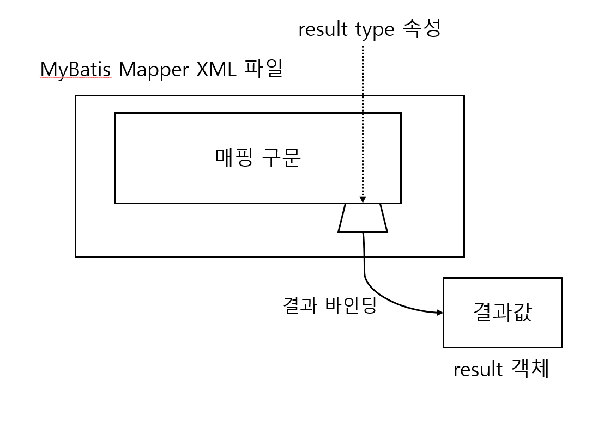
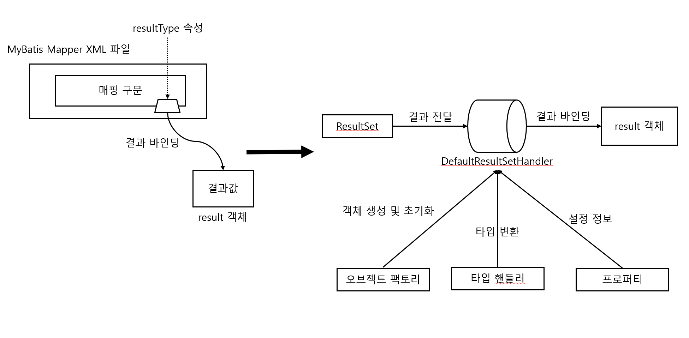
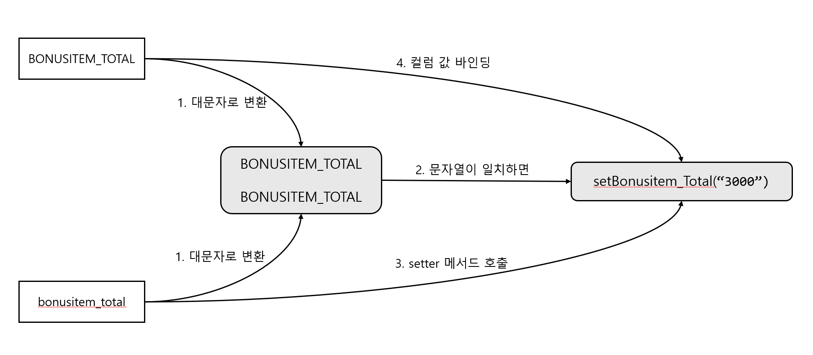
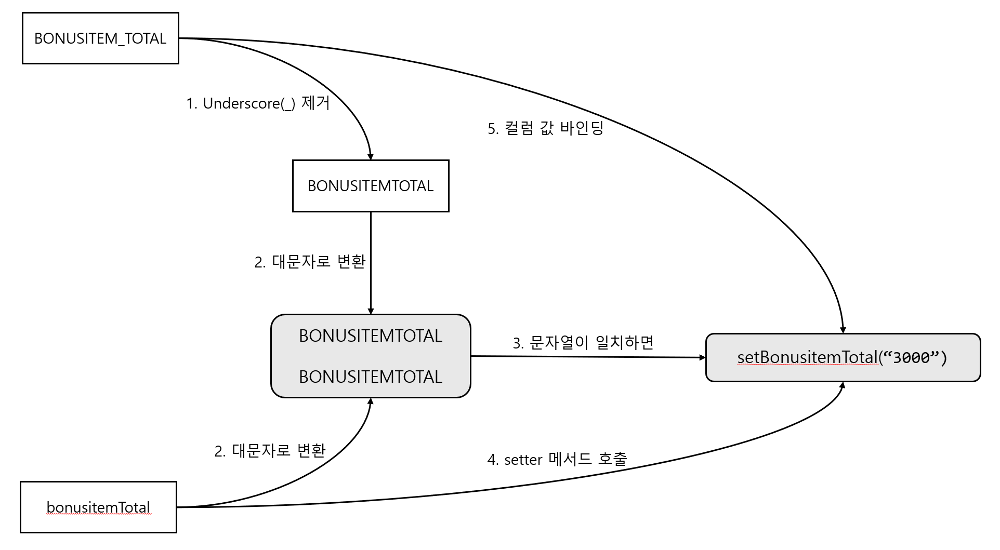

# 리팩토링이라는 삽질을 통해 알아낸 MyBatis의 매핑 원리와 세팅 옵션

## 개요

Spring Framework, MyBatis 스택의 실무 환경에서 resultMap 으로 반환타입을 묶은, 4천 줄의 코드 라인을 30% 가량 줄이면서 겪었던 삽질(?)과, 이를 해결하면서 알게 된 MyBatis의 매핑 원리와 활용했던 옵션에 대해 설명한다.

---

## 기존에 있던 VO와 xml에 있던 resultMap, select문

### 필드와 getter메서드만 있는 VO 클래스

```java
public class EmpSalaryVO {
    private String bonusitem1;
    private String bonusitem2;
    private String bonusitem3;
    private String bonusitem4;
    private String bonusitem5;
    private String bonusitem6;
    private String bonusitem7;
    private String bonusitem8;
    private String bonusitem9;
    private String bonusitem10;
    private String bonusitem11;
    private String bonusitem_total;

    public String getBonusItem1() {
        return bonusitem1;
    }
    public String getBonusItem1() {
        return bonusitem1;
    }
    public String getBonusItem2() {
        return bonusitem2;
    }
    public String getBonusItem3() {
        return bonusitem3;
    }
    public String getBonusItem4() {
        return bonusitem4;
    }
    public String getBonusItem5() {
        return bonusitem5;
    }
    public String getBonusItem6() {
        return bonusitem6;
    }
    public String geBonustItem7() {
        return bonusitem7;
    }
    public String getBonusItem8() {
        return bonusitem8;
    }
    public String getBonusItem9() {
        return bonusitem9;
    }
    public String getBonusItem10() {
        return bonusitem10;
    }
    public String getBonusItem11() {
        return bonusitem11;
    }
    public String getBonusItem_total() {
        return bonusitem_total;
    }
}
```


### resultMap을 쓰고 있는 select문

```xml
...

<resultMap id="EmpSalaryMap" type="EmpSalaryVO">
    <result column="BONUSITEM1" property="bonusitem1">
    <result column="BONUSITEM2" property="bonusitem2">
    <result column="BONUSITEM3" property="bonusitem3">
    <result column="BONUSITEM4" property="bonusitem4">
    <result column="BONUSITEM5" property="bonusitem5">
    <result column="BONUSITEM6" property="bonusitem6">
    <result column="BONUSITEM7" property="bonusitem7">
    <result column="BONUSITEM8" property="bonusitem8">
    <result column="BONUSITEM9" property="bonusitem9">
    <result column="BONUSITEM10" property="bonusitem10">
    <result column="BONUSITEM11" property="bonusitem11">
    <result column="BONUSITEM_TOTAL" property="bonusitem_total">
</resultMap>

<select id="selectEmployeeSalary" parameterType="HashMap" resultMap="EmpSalaryMap">
    select
        A.ba1 AS BONUSITEM1,
        A.ba2 AS BONUSITEM2,
        A.ba3 AS BONUSITEM3,
        A.bb1 AS BONUSITEM4,
        A.bb2 AS BONUSITEM5,
        A.bb3 AS BONUSITEM6,
        A.bc1 AS BONUSITEM7,
        A.bc2 AS BONUSITEM8,
        A.bc3 AS BONUSITEM9,
        B.bd1 AS BONUSITEM10,
        B.dd2 AS BONUSITEM11,
        (A.sum + B.sum) AS BONUSITEM_TOTAL
    from emp_salarya A, emp_salaryb B
    where id=#{id}
</select>
```

#### resultMap이란?

resultMap은 **컬럼명과 프로퍼티명이 바인딩 규칙을 벗어날 때** 사용한다.

resultMap을 사용하면 반환된 result를 **사용자가 원하는 프로퍼티에 자유롭게 바인딩**할 수 있다.  
즉, 반환된 ResultSet을 지정한 result 객체에 전달하는 **중간 역할을 수행**한다.



resultMap을 구성하는 기본 단위는 `result 구성 요소`이며, `<result />`를 사용해서 지정한다.




### AJAX로 요청했던 합계데이터 뿌리기

이렇게 조회한 합계 데이터는 `_total`이라는 텍스트를 붙여 값을 뿌려준다.

```javascript
$.ajax({
  ...
  success : function(result) {
      // 합계 데이터를 tr 태그 사이로 뿌려줌
      html += "<tr>" + result[0][type + '_total'] + "</tr>";
  }
});
```


## 문제 발생 및 해결 과정

### 리팩토링 후 문제 발생

기존에는 조회하는 컬럼들을 모두 alias로 이름을 따로 지정해준 뒤 resultMap으로 한 번 더 이름을 매핑하던 방식을 썼었다.

이러한 방식은 급여의 종류가 추가됨에 따라 컬럼을 추가하고 데이터를 넣는 등의 작업을 했을 때, `<resultMap>`안에 `<result>` 요소를 일일이 스크롤을 돌려가면서 추가해야했다.

여기서 resultMap을 제거한 뒤 alias만 사용하도록 하면 코드의 양도 줄고 컬럼 및 필드를 추가하는 작업을 할 때 한결 수월해질거라 생각하여, resultType 속성으로 VO클래스를 직접 매핑하도록 했다.

값들이 map 없이도 잘 나오는 걸 확인한 후에 운영에 코드를 반영했지만, 알고 보니 각 종류의 월급 값들은 잘 나와도 합계가 안 나오는 것이었다.  
확인해보니, 총합을 나타내는 `_total`은 매핑이 되지 않고 있었다.


### 찝찝한 핫픽스 후 다시 리팩토링

서버를 직접 내렸다 올려야 하는 운영 특성상 서버를 일과시간에 중단할 수 없어 프론트(jsp)단에서 해결하기로 했다.  
프론트 단에서 `total` 값을 직접 출력하지 않고, for문으로 각 값을 합한 값을 출력하는 방식으로 급하게 반영을 마무리 했다.

핫픽스 후 이상은 없었지만, 프론트 단에는 이전부터 분기 처리 로직이 많아 디버깅할 때 이를 육안으로 확인하는 번거로움이 예상됐다.

```javascript
$.ajax({
  ...
  success : function(result) {
      // 월급합계는 그 한달의 여러 종류의 월급을 합한 값
      let 월급합계;
      for(해당 월급 타입의 개수) {
        월급합계 += 월급;
      }
      
      html += "<tr>" + 월급합계 + "</tr>";
  }
});
```

번거로움을 줄이고 이전과 같은 에러도 방지하고자 MyBatis 설정 XML 파일에 이미 설정되어 있던 `settings` 엘리먼트의 `mapUnderscoreToCamelCase`속성을 활용하기로 했다.

```xml
<settings>
    <setting name="mapUnderscoreToCamelCase" value="true"/>
</settings>
```

이 설정을 활용하여 프론트(JSP) 단에 있던 **for문을 다시 제거**한 뒤 **VO에는 `_total`이 붙은 필드 이름을 카멜케이스로 바꿔** 마무리했다.

기존 4천 라인이던 코드를 2천 8백 라인으로 수정을 완료했고, 번거로운 작업도 한 줌 덜게 되었다.

---

## MyBatis의 매핑 원리와 세팅 옵션 이해하기

### MyBatis 매핑 원리

#### 매핑 구문에 resultType 속성을 지정했을 때의 모습



`매핑 구문`을 실행한 다음 `resultType 속성`으로 반환된 **결과를 바인딩** 해준다.   
result 전달에 사용한 객체를 `result 객체`라고 이해하면 된다.


#### 반환된 조회 결과는 result 객체에 어떻게 바인딩 될까?

> ResultSet 핸들러는 resultType 속성에 지정한 타입의 객체를 생성한 다음 ResultSet에 담긴 조회 결과를 바인딩한다.
> 
> 그 과정에서 오브젝트 팩토리와 타입 핸들러, 프로퍼티가 사용된다.

DefaultResultSetHandler 클래스로 자세한 과정을 알아보자.



매핑 구문을 실행한다
-> 반환된 ResultSet에 결과가 존재하면
-> `오브젝트 팩토리`는 **resultType 속성에 지정한 객체를 생성 및 초기화**한다  
-> 컬럼명과 프로퍼티명이 맞으면 `프로퍼티의 설정 정보`와 `타입 핸들러의 타입 변환`를 통해서 생성한 **객체에 값을 바인딩**한다. 즉, 프로퍼티 값에 컬럼 값을 바인딩한다
  

`BONUSITEM_TOTAL`라는 이름의 컬럼이 출력되면 대소문자 상관없이 대문자로 비교했을 때 `BONUSITEM_TOTAL`과 비교해서 같으면 매핑된다.


### 자바빈즈(VO) 객체에 컬럼 값을 바인딩하는 과정

`<settings>` 구성 요소에 mapUnderscoreToCamelCase라는 옵션 설정 여부에 따라 바인딩하는 과정이 달라진다.

두 경우로 나눠 살펴볼 수 있다.

#### mapUnderscoreToCamelCase라는 속성 값이 없거나 false일 때



조회한 `컬럼명`과 VO에 정의한 `프로퍼티명`을
1. 각각 대문자로 변경한 다음
2. 서로 비교했을 때 일치하면
3. setter 메서드를 호출하여
4. 프로퍼티 값에 컬럼 값을 바인딩한다.
   - 이때, 자바빈즈 명세에 맞는 setter 메서드가 정의되어 있지 않아도, 런타임 때 동적으로 특정 클래스의 정보를 추출(reflection)하는 과정을 통해 프로퍼티에 컬럼 값을 바인딩한다.
  
#### mapUnderscoreToCamelCase라는 속성 값이 true일 때



MyBatis 설정 XML파일에
```xml
<settings>
    <setting name="mapUnderscoreToCamelCase" value="true"/>
</settings>
```

`mapUnderscoreToCamelCase` 속성 값을 true로 지정하면, 바인딩 과정을 거치기 전에 컬럼명에서 먼저 `Underscore(_)`기호가 제거된다.

1. 위 그림을 예시로 들면, `BONUSITEM_TOTAL` 컬럼명에서 `_` 기호를 제거한 다음 대문자로 변경하면 `BONUSITEMTOTAL`이라는 문자열이 된다.
2. 그리고 VO에 정의한 `bonusitemTotal`을 대문자로 변경하면 `BONUSITEMTOTAL`이 되므로
3. 1번과 2번에 나온 이 둘을 서로 비교했을 때 일치하면
4. `bonusitemTotal`프로퍼티에 `BONUSITEM_TOTAL`컬럼의 값을 바인딩한다.


## 코드 라인 수 줄인 게 엄청난 일은 아니지만

1. 매 달마다 작업해야 하는 일의 노동력을 줄여 다른 곳에 에너지를 쓸 수 있음에 의의를 두고 있다.  
2. 이 코드 말고도 내가 짠 `레거시` 코드 중에는 이번 주제와 같이 불필요한 코드가 많기에, 이를 줄이면서 혼재된 네이밍 컨벤션을 바로 잡는데 기여하려고 한다.