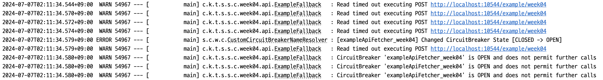

# 침묵을 지키는 CircuitBreaker: 사라져 버린 로그

## 배경 내용

* [resilience4j CircuitBreaker](https://resilience4j.readme.io/docs/getting-started-3)를 통해 각 API client에 서킷브레이커 설정을 적용
  * 특정 API에 대해 기준점 이상으로 timeout이 발생할 경우 circuit이 열리도록 설정
* Circuit의 상태가 변할 때 로그를 출력하도록 설정
* RESTful API 호출을 위한 HTTP Client는 [Feign Client](https://cloud.spring.io/spring-cloud-openfeign/reference/html/)를 사용

### 배경 내용 상세

CircuitBreaker 설정은 다음과 같이 작성하였습니다.

```kotlin
@Configuration
class ResilienceConfiguration(
    private val registry: CircuitBreakerRegistry
) {
    private val log = LoggerFactory.getLogger(this::class.java)

    // 정의한 형태로 feign Client별로 서킷브레이커 이름을 정함
    @Bean
    fun circuitBreakerNameResolver(): CircuitBreakerNameResolver {
        return CircuitBreakerNameResolver { feignClientName: String, _, method: Method -> feignClientName + "_" + method.name  }
    }

    // CircuitBreakerRegistry 내에 등록된 모든 서킷브레이커에 대해, 상태 변화 시 로그를 출력하도록 설정
    @PostConstruct
    fun registerEvents() {
        registry.allCircuitBreakers.forEach {
            it.eventPublisher.onStateTransition { e ->
                log.error(
                    "[{}] Changed CircuitBreaker State [{} -> {}]",
                    it.name,
                    e.stateTransition.fromState,
                    e.stateTransition.toState
                )
            }
        }
    }
}
```

## 문제

위와 같이 설정했지만, 어떤 feign Client의 state change에도 로그가 출력되지 않았습니다.

## 원인

Spring Boot 시작 시, 아래 순서로 진행됩니다.

* read application.yml
* environment preparation (저희의 경우 local, sandbox, beta, production)
* spring contexts initialisation
* bean initialisation

위에서 작성한 ResilienceConfiguration은 `circuitBreakerNameResolver`를 Bean으로 등록합니다. 이 전에, `PostConstruct` 어노테이션으로 인해 `registerEvents`가 실행됩니다.


이 때 생성된 circuit breaker의 수는 **0**입니다.

앞에서 언급한 바와 같이, 각 feign client가 최초 호출 시, `circuitBreakerNameResolver`를 통해 이름을 가져오고, 이 이름으로 circuit breaker를 생성합니다.

따라서 위의 설정이 전혀 적용되지 않습니다.

## 시도한 해결법

`CircuitBreakerNameResolver`는 인터페이스입니다. 이를 아래와 같이 직접 구현하였습니다.

```kotlin
@Configuration
class CustomCircuitBreakerNameResolver(
    private val registry: CircuitBreakerRegistry
) : CircuitBreakerNameResolver {
    private val log = LoggerFactory.getLogger(this::class.java)

    override fun resolveCircuitBreakerName(feignClientName: String?, target: Target<*>?, method: Method): String {
        val url: String? = target?.url()
        val circuitBreakerName =
            try {
                feignClientName + "_" + method.name
            } catch (e: MalformedURLException) {
                log.error("MalformedURLException : {}", url)
                "default"
            }

        if (registry.allCircuitBreakers.map { it.name }.contains(circuitBreakerName).not()) {
            registry.circuitBreaker(circuitBreakerName)
                .eventPublisher.onStateTransition { event ->
                    log.error(
                        "[{}] Changed CircuitBreaker State [{} -> {}]",
                        circuitBreakerName,
                        event.stateTransition.fromState,
                        event.stateTransition.toState
                    )
                }
        }

        return circuitBreakerName
    }
}
```

이름을 가져와 circuit breaker에 등록할 때, `onStateTransition` 설정까지 같이 해 주도록 하였습니다.

## 결과


