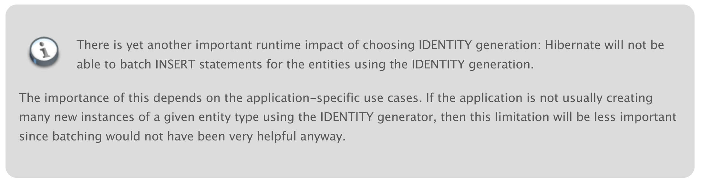

## 개요

라이브 서비스에서 대량의 데이터를 한 번에 저장할 때 발생한 고민들을 다룹니다. JPA bulk insert의 동작 방식과 한계점을 알아 보고, JDBCTemplate와 함께 사용했던 경험을 공유합니다.

## 목차

1. 배경
2. JPA를 쓰면 안 되나요?
3. JdbcTemplate을 쓰면 어떨까요?
4. 이렇게 썼어요
5. 마무리

## 배경

배치가 아니더라도, 서비스를 개발하다 보면 대량의 데이터를 한 번에 저장해야 하는 경우가 발생합니다.

* Admin에서 excel 업로드를 통해 수천건의 데이터 한 번에 저장
* Kafka 특정 메세지 consume 시, 외부 API 호출하여 응답을 저장

특히 두 번째 예시의 경우, consume이 초당 수십~수백 회 일어나고, 한 번에 수백 건의 데이터를 저장하게 된다면, 데이터를 저장하는 시간을 짧게 가져가는 편이 여러모로 좋습니다.

* 저장 속도
* DB Connection Pool을 잡아 사용하는 빈도

기존에 JPA를 서비스 전반에 활용하고 있으면서, 이를 해치지 않고 성능 이점을 가져가기 위해 리팩토링을 진행했습니다.

## JPA를 쓰면 안 되나요?

JPA는 아래와 같은 API를 제공합니다.

```java
// ListCrudRepository.java

/**
 * Saves all given entities.
 *
 * @param entities must not be {@literal null} nor must it contain {@literal null}.
 * @return the saved entities; will never be {@literal null}. The returned {@literal Iterable} will have the same size
 *         as the {@literal Iterable} passed as an argument.
 * @throws IllegalArgumentException in case the given {@link Iterable entities} or one of its entities is
 *           {@literal null}.
 * @throws OptimisticLockingFailureException when at least one entity uses optimistic locking and has a version
 *           attribute with a different value from that found in the persistence store. Also thrown if at least one
 *           entity is assumed to be present but does not exist in the database.
 */
<S extends T> List<S> saveAll(Iterable<S> entities);
```

구현체를 살펴 보면,

```java
// SimpleJpaRepository.java

@Transactional
@Override
public <S extends T> List<S> saveAll(Iterable<S> entities) {

    Assert.notNull(entities, "Entities must not be null");

    List<S> result = new ArrayList<>();

    // 여기가 본론
    for (S entity : entities) {
        result.add(save(entity));
    }

    return result;
}
```

즉 `saveAll()` 메서드는 각 JPA 엔티티에 대해 `save()`를 각각 실행하는 것과 완전히 동일합니다.

실제로 `saveAll()`을 사용할 경우, 각 건마다 `INSERT INTO...` SQL이 각각 실행됩니다. 비록 단일 `@Transactional`로 묶여 있지만, SQL이 여전히 각각 실행되기 때문에 개수만큼 네트워크 송수신이 이루어지고, DB에서 SQL을 각각 처리하기 때문에 시간 낭비가 크게 발생합니다.


### JPA도 bulk insert를 지원하지 않나요?

JPA도 자체적으로 bulk insert를 지원합니다 (batch insert와 용어가 혼용되어 사용되는데, 여기서는 '대량의 데이터를 한 번에 insert한다'를 bulk insert로 통일해서 부르겠습니다).

application.yml에서 아래와 같이 설정하면 사용할 수 있습니다. MySQL의 예시입니다.

```yaml
spring:
  jpa:
    database: mysql
    properties:
      hibernate:
        jdbc.batch_size: 50
        order_inserts: true
        order_updates: true
        dialect: org.hibernate.dialect.MySQL5InnoDBDialect
        show_sql: true

  datasource:
    url: jdbc:mysql://localhost:3366/week_07?useSSL=false&serverTimezone=UTC&autoReconnect=true&rewriteBatchedStatements=true
    driver-class-name: com.mysql.cj.jdbc.Driver
```

눈여겨볼 점은 `datasource.url`의 `rewriteBatchedStatements=true` 옵션입니다. 위 옵션의 기본값은 `false`인데, `true`로 설정해 주어야 JPA에서 bulk insert를 사용할 수 있습니다.

그리고 한 가지 더 주의할 점이 있는데요,



Entity의 `id`의 `GenerationType`을 `IDENTITY`로 설정할 수 없습니다. `IDENTITY`는 insert 시 DB가 PK ID를 생성하도록 위임합니다. Hibernate는 entity 목록에 대해 bulk insert를 수행하기 전에 생성된 ID를 알아야 합니다. `IDENTITY`를 사용할 경우, bulk insert를 수행하는 시점에 ID를 알 수 없기 때문에 함께 사용할 수 없습니다.

위 두 부분 때문에 JPA bulk insert를 포기하게 되었습니다. 기존에 운영 중인 서비스의 JDBC 설정을 일괄 변경하는 것도 내키지 않았고, bulk insert를 위해 기존 entity를 수정하거나, 같은 entity를 `GenerationType`만 바꾸어 사용하는 것도 entity의 파편화라고 생각하여 내키지 않았습니다. 결국 다른 방법을 고민해 보기로 했습니다.

## JdbcTemplate을 쓰면 어떨까요?

JdbcTemplate을 사용하는 방법도 있습니다. 장단점이 명확한데,

* 장점: SQL을 직접 작성해서 호출하면 손쉽다.
* 단점: SQL을 직접 작성해야 한다.

JPA와는 여러모로 대척점에 있는 선택지라고 볼 수 있습니다. JPA의 `saveAll()`과 같은 목적으로 사용한다면, `JdbcTemplate`의 `batchUpdate()`를 사용할 수 있습니다.

```java
// NamedParameterJdbcTemplate.java

@Override
public int[] batchUpdate(String sql, SqlParameterSource[] batchArgs) {
    if (batchArgs.length == 0) {
        return new int[0];
    }

    ParsedSql parsedSql = getParsedSql(sql);
    PreparedStatementCreatorFactory pscf = getPreparedStatementCreatorFactory(parsedSql, batchArgs[0]);

    return getJdbcOperations().batchUpdate(
        pscf.getSql(),
        new BatchPreparedStatementSetter() {
            @Override
            public void setValues(PreparedStatement ps, int i) throws SQLException {
                Object[] values = NamedParameterUtils.buildValueArray(parsedSql, batchArgs[i], null);
                pscf.newPreparedStatementSetter(values).setValues(ps);
            }
            @Override
            public int getBatchSize() {
                return batchArgs.length;
            }
        });
}

@Override
public int[] batchUpdate(String sql, Map<String, ?>[] batchValues) {
    return batchUpdate(sql, SqlParameterSourceUtils.createBatch(batchValues));
}

// JdbcTemplate.java
@Override
public int[] batchUpdate(String sql, final BatchPreparedStatementSetter pss) throws DataAccessException {
    if (logger.isDebugEnabled()) {
        logger.debug("Executing SQL batch update [" + sql + "]");
    }
    int batchSize = pss.getBatchSize();
    if (batchSize == 0) {
        return new int[0];
    }

    int[] result = execute(sql, getPreparedStatementCallback(pss, null));
    Assert.state(result != null, "No result array");
    return result;
}
```

`NamedParamterJdbcTemplate`도 결국 내부적으로는 `JdbcTemplate`를 호출하므로 둘은 같습니다.

## 이렇게 썼어요

제 목적은, 기존에 사용하던 JPA 구조를 최대한 변경하지 않으면서, JdbcTemplate를 함께 사용하는 것입니다. 이를 위해 고려해야 하는 점은 아래와 같은데,

* NamedParameter 매칭을 위한 key 목록 작성
* `@Converter` 사용
  * 예: `BooleanToYnConverter`, `StringEncryptConverter`

첫 술에 배부를 수는 없으니, 우선 아래와 같이 코드를 작성해서 사용했습니다.

```kotlin
@Repository
class Week07SampleJdbcRepository(
    private val jdbc: NamedParameterJdbcTemplate,
    private val databaseKeyIv: KeyIv
) {
    companion object {
        const val INSERT_SQL = """
            insert into week07_sample_table_name
            (study_yn, phone_number)
            values
            (:isStudy, :phoneNumber)
        """
    }

    fun saveAll(entities: List<Week07SampleEntity>) {
        jdbc.batchUpdate(
            INSERT_SQL.trimIndent(),
            entities
                .map { it.toInsertMap() }
                .toTypedArray()
        )
    }

    private fun Week07SampleEntity.toInsertMap(): Map<String, Any?> {
        val booleanToYnConverter = BooleanToYnConverter()
        val stringEncryptConverter = StringEncryptConverter(databaseKeyIv)

        return mapOf(
            "isStudy" to booleanToYnConverter.convertToDatabaseColumn(isStudy),
            "phoneNumber" to stringEncryptConverter.convertToDatabaseColumn(phoneNumber)
        )
    }
}
```

위 코드는 아래 목적을 달성합니다.

* JPA Entity를 그대로 사용하면서, repository의 사용 방법도 거의 동일함
* JdbcTemplate에 필요한 SQL을 **어느 정도**는 자동으로 생성
* JPA의 Converter도 그대로 사용
* JPA 및 datasource의 기존 설정을 변경하지 않고 사용

다만 아래와 같은 한계가 있습니다.

* Entity별로 직접 구현해야 하는 내용이 상당히 많음
  * `INSERT_SQL`, `.toInsertMap()`이 변화에 매우 취약함, 유지보수성 매우 불편
* `KeyIv`의 경우 `@Bean`을 통해 가져오고 있다는 한계

그럼에도 우선 원하는 목적을 달성하여, 현재는 위와 같이 사용하고 있습니다.

## 마무리

모든 경우에 통하는 실버불릿은 없고, 위의 경우도 마찬가지인 것 같습니다. 다양한 기술 선택지가 존재하지만 어느 것도 저의 니즈를 100% 충족시키지 못하는 경우, 이렇게 조금 손을 봐서 목적을 달성하는 것도 때로는 필요한 역량이라고 생각합니다.

Kotlin을 사용하는데 꼭 JPA를 사용해야 할까요? 그렇지 않습니다. Kotlin의 ORM 프레임워크인 Exposed도 있는데요, 마찬가지로 고려했으나 이번에는 채택하지 않았습니다.

## References

* [JdbcTemplate을 활용하여 JPA의 saveAll() 대체하기](https://hyunwook.dev/221)
  * 앞의 내용은 무시하고, 맨 뒤의 속도 비교만 참고

* [MySQL Documentation Connectors 6.3.13 Performance Extensions](https://dev.mysql.com/doc/connector-j/en/connector-j-connp-props-performance-extensions.html)
  * rewriteBatchedStatements

* [Hibernate ORM 5.4.33.Final User Guide](https://docs.jboss.org/hibernate/orm/5.4/userguide/html_single/Hibernate_User_Guide.html#identifiers-generators-identity)
* [Batch Insert 성능 향상기 1편 - With JPA](https://cheese10yun.github.io/jpa-batch-insert/)
* [StackOverflow - Why does Hibernate disable INSERT batching when using an IDENTITY identifier generator](https://stackoverflow.com/questions/27697810/why-does-hibernate-disable-insert-batching-when-using-an-identity-identifier-gen/27732138#27732138)
