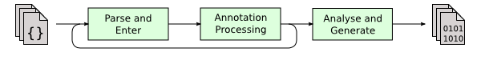
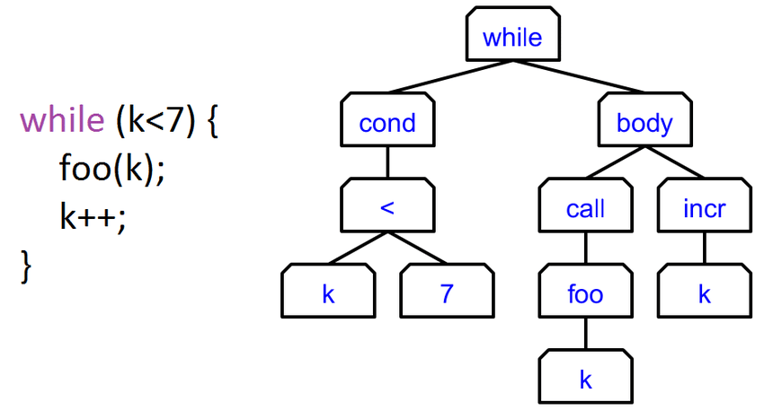

# Java 17-21 내 Record에 대한 고찰

## Record 개론
JDK 16부터 등장한 개념으로, (JDK 14 에서 Preview로 먼저 등장) 간단하게 말해선 **불변 객체** 를 만들기 위한 데이터 클래스라고 생각할 수 있습니다.

사용 방법은 되게 간단합니다.
```java
public record Test(
    int a,
    int b,
    String c
) {

}
```

하지만... 저희가 고작 이거 보려고 온건 아니겠죠? 다들 기본적으로 "있다" 정도는 아실겁니다.
이번 시간에는 좀 더 깊은 고민을 해보도록 합시다.

## Record의 내부 구조
JDK의 내부 코드는 엄밀히 말해서 각 구현체마다 다릅니다. (컴파일러의 구조도 다르고요.)
그래서 정확한 구조를 확인하기 위해선 [Java Language Specfication](https://docs.oracle.com/javase/specs/jls/se22/jls22.pdf) 을 참조해야 합니다.

해당 스펙에 대해선 각자 참고해보시면 좋을 것 같고... 저희는 Spec 보다는 실전적인 구조를 좀 보도록 합시다.

Record에 대응하는 클래스인 `Record.java` 라는 파일을 열어보면, 주석과 메인 시그니쳐가 다소 흥미롭습니다.

```java
/**
 * A record class has the following mandated members: a canonical constructor, which must provide at least as much access as the record class and whose descriptor is the same as the record descriptor; a private final field corresponding to each component, whose name and type are the same as that of the component; a public accessor method corresponding to each component, whose name and return type are the same as that of the component. If not explicitly declared in the body of the record, implicit implementations for these members are provided.
 */

public abstract class Record {
    /**
     * Constructor for record classes to call.
     */
    protected Record() {}
    // 중략
}
```

- Record는 abstract class 이다.
- Getter나 Canonical Constructor, 기타 필요한 메서드를 생성해 준다. (참고로 해당 Abstract Class에는 해당 메서드에 대한 코드가 없습니다.)

음? 좀 더 자세히 확인해보기 위해 위 Record의 예제를 디컴파일 해 보았습니다.

```java
Compiled from "Test.java"
public final class Test extends java.lang.Record {
  public Test(int, int, java.lang.String);
  public final java.lang.String toString();
  public final int hashCode();
  public final boolean equals(java.lang.Object);
  public int a();
  public int b();
  public java.lang.String c();
}
```

사실 이 코드를 보면 알 수 있지만, 사실상 Record는 **Syntantic Sugar** 와 다름 없는, 기존의 Java의 기능과 비교하여 큰 차이가 없는 기능임을 확인할 수 있습니다.

조금만 더 깊게 들어가 볼까요? (생각보다 많은 원리에 대해 알 수 있을 거에요. 이후 주제에 대한 힌트가 될 수도?)

Java의 컴파일 과정을 살펴봅시다.... 는 사실 엄격하게 정해져 있진 않아요. (이것도 JDK 구현체마다 약간의 차이가 있습니다 ㅠㅠ)

우리는 OpenJDK의 컴파일 형식에 대해 알아보도록 합시다.
컴파일러를 제대로 공부하시면 더 자세하게 나눠야 한다는걸 알지만... 그래도 간단하게 살펴보면 이런 단계로 요약할 수 있어요.


- Parse & Enter: 작성한 코드를 모두 읽어들이고, AST (Abstract Syntax Tree) 형태로 만들어 줍니다.
- Annotation Processing: Annotation Processor가 호출되고, 뭔가 Annotation Processor에 의해 처리되어 생성된 코드가 있다면, 이를 포함하여 재컴파일을 반복적으로 진행합니다.
- Analyse & Generate: 최종적으로 완성된 AST에 대해, 최적화와 다양한 과정을 거친 후 우리가 아는 .class 파일로 변환해 줍니다.



엄밀히 말하면 훨씬 복잡하지만, AST의 개념은 대충 이런 느낌이라고 보시면 됩니다.
여하튼 이 과정에서 Record 시그니쳐는 java.lang.Record를 extend 하는 형태로 변하게 되고, 그래서 최종적으로는 위 처럼 클래스와 유사하게 사용할 수 있는 것이죠.

(정확하지는 않지만, 저 위쪽의 다양한 메서드도 어느 타이밍에 자연스럽게 생성될 수 있다는 것도 예측할 수 있겠죠?)

## 그래서, Kotlin의 Data Class와는 어떻게 다른데?

위에서 길게 설명한 Record의 내부 구조를 통해 우리는 Record가 사실은 Class 이며, Syntantic Sugar로 간주할 수 있다는 말을 했습니다.

즉, Record는 Syntantic Sugar이기에 **일반 Class 관점** 으로 봐야 합니다.
- final class 형태이므로 상속이 불가능하며,
- 이미 특정 class를 상속하고 있으므로 다른 클래스를 상속할 수 없고,
- 기본적으로 생성해주는 class의 기본 메서드를 제외한 메서드는 존재하지 않습니다.

저는 Kotlin의 Data Class가 솔직히 좀 부러웠어서, (특히, Data Class의 copy() 메서드가 너무 부러웠어요!) Reflection을 활용해 유사하게 구현했었습니다.
```java
@SuppressWarnings("unchecked")
public static <T extends Record> T copy(T template, Map<String, Object> overrideFields) {
	try {
		var types = new ArrayList<Class<?>>();
		var values = new ArrayList<>();

		for (var component : template.getClass().getRecordComponents()) {
			types.add(component.getType());
			var name = component.getName();
			var isOverride = overrideFields.containsKey(name);
			values.add(isOverride ? overrideFields.get(name) : component.getAccessor().invoke(template));
		}

		var canonicalConstructor = template.getClass().getDeclaredConstructor(types.toArray(Class[]::new));

		return (T)canonicalConstructor.newInstance(values.toArray(Object[]::new));
	} catch (ReflectiveOperationException e) {
		throw new IllegalArgumentException(StringUtil.format("Reflection failed: {}", e), e);
	}
}
```

(설명 추가 TODO)

## 잠깐 추가 이야기를 하기 전, 이후의 JDK의 방향성에 대해

결론만 말씀 드리면, **JDK는 Record를 적극 권장하는 방식으로 발전하고 있습니다.**
(추가 예정 TODO)

왜 Record가 권장되기 시작할까요? 이는 수많은 프로그래밍 패러다임에서 중요하게 언급되고 있는 **불변 객체 사상**에 대해 이해할 필요가 있습니다.

## 불변 객체 사상
