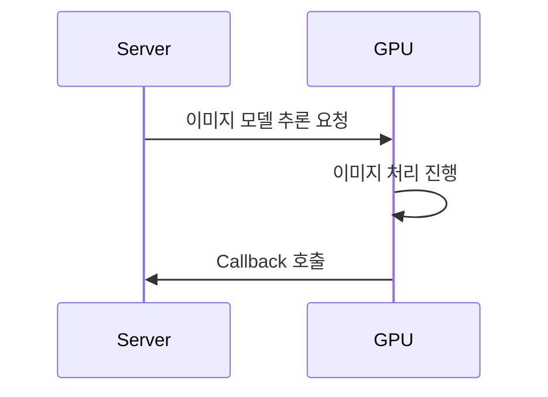
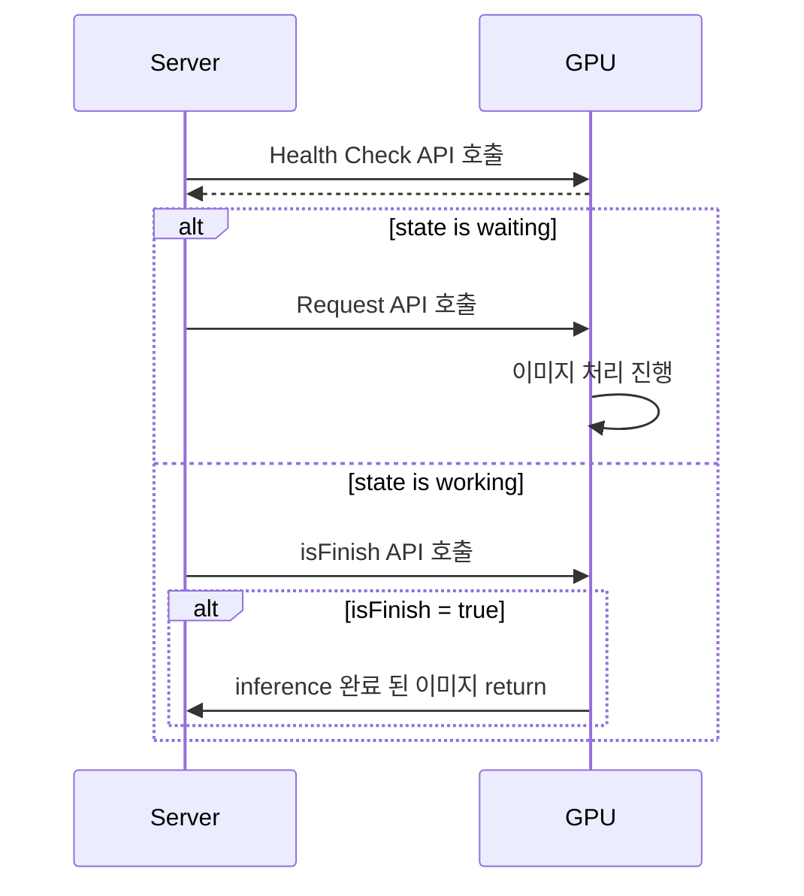
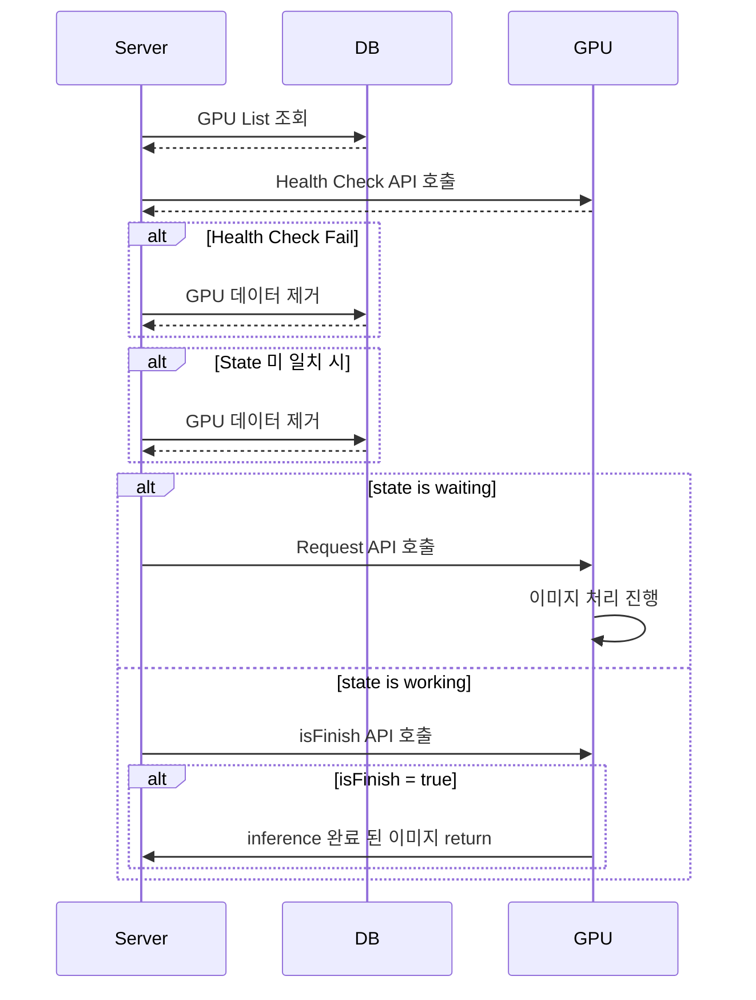

# 독수리 사진관 프로젝트 수행기 - #1
## 무슨 프로젝트인데?


간단하게 말해서, 사진 여러장을 주면 ML 모델을 열심히 돌려서 AI 프로필 사진을 만들어주는 서비스 입니다. 

저는 이제 학생이 아니니까.. 원래는 참여를 안 하려고 했는데 팀장이 "너 아니면 할 사람 없어~~" 라는 말로 자꾸 저를 괴롭히더라고요.

결국 "설계는 내가 할테니 코딩할 다른 사람을 데려와라" 라고 하면서 기본적인 조건 몇개를 걸었는데, 아쉽게도 사람을 못 구해서 결국은 제가 독박 썼습니다 (??)

일반적인 서비스와 달리 GPU를 사용한다는 점, 그리고 ML을 담당한 분이 엔지니어링 보다는 리서치에 가까우셨기 때문에 서버의 역할이 좀 더 중요해 졌습니다.

이번과 다음 발표동안, 이 짧은 프로젝트에서 서버는 어떤 고민을 했는지/이 문제를 어떤 방식으로 해결했는지에 대해 설명하려고 합니다.

## 발생했던 문제들
~~결국은 서버가 다 함~~
이 프로젝트는 행사 전 까지 모델을 열심히 깎고, 행사 동안은 학습 완료된 모델을 Inference 하는 기본적인 구조를 띄고 있었습니다. 하지만 Inference 단계에서 생각보다 많은 시간 (과 GPU 자원)이 들었다는 점, 그리고 그 GPU가 후원 받은 GPU 였다는 점 때문에 다음과 같은 고민이 필요했습니다.

- 클라우드 GPU가 아닌, 실제 물리적 GPU를 할당 받았기 때문에, 중간에 GPU를 Cool-down 시킬 필요가 있음.
- 요청이 많아지면 다른 GPU를 공수해와서 추가적으로 Task를 할당해야 함.

또한, 자원의 특성상 잘못된 요청/어뷰징이 들어왔을 때의 Risk가 더 커지기 때문에, **접근제한 관점**에서 이전 서비스보다도 더욱 엄격한 정책이 필요했습니다.

마지막으로, 상술했듯 ML을 담당했던 분이 엔지니어링에 대한 경험이 많지 않았기 때문에, 모델 서버 측 개발 부담을 최소화 하면서도 위와 같은 요구사항을 모두 만족할 필요가 있었습니다.

## GPU의 State 정의하기
가장 먼저, 모델 서버 측에 "최소한"의 API를 할당하는 방법에 대해 고민했습니다. 최대한 프론트/미들 서버 측에서 가능한 한 많은 로직을 담당하고, 모델 서버는 최소한의 API 만 개발하도록 해 부담을 줄이는게 목적이었기 때문입니다.

일반적인 모델 서버라면, 다음과 같은 구상을 해 볼 수 있을 것 같습니다.


문제는... 상술했듯이 GPU 서버 측에서 이런 구현이 어려운듯 해서... **Server가 GPU의 State를 파악해서 처리 종료를 인식하는 방식**의 구조를 설계할 필요가 있었습니다.

또한, 어찌되었든 GPU는 유동적으로 할당 될 필요가 있기도 했고, 정상적으로 GPU가 돌지 않을 때의 에러 인식도 Server에서 해 줄 필요가 있었습니다. (개발을 하다보면, 점점 갈수록 외부 컴포넌트에 대한 신뢰를 낮추고, 각 컴포넌트가 정상적으로 돌아가는지를 Server에서 반드시 체크해야 한다는 것을 점점 깨닫게 되더라고요.)

가장 쉬운 문제 부터 해결해 봅시다. 정상적으로 GPU가 돌고 있는지 확인하기 위해선, 우선 **GPU의 Health Check**를 수행해야 합니다. 따라서 GPU의 State를 체크하는 API를 Health Check 용도로 사용하도록 만들어 줍시다. 

그리고 결국은 GPU에 요청을 보내야 하고, 위에서 언급했듯이 요청이 끝났으면 서버에서 결과를 가져오도록 해야 합니다.

결국 우리는 상황에 따라서 GPU에 호출해야 하는 API가 매번 다르다는 것을 알 수 있습니다. 문제는, **GPU가 일반적인 서버와 동일하게 Stateless 하다면, 특정 시나리오를 파악하기 위한 난이도가 훨씬 올라간다**는 것 입니다. 예를 들어, GPU가 Stateless 하다면, 우리가 Submit한 이미지의 정보를 다시 가져올 수 없기 때문이죠. (사실 위에서 언급한 이상적인 시나리오라면 Stateless 한 Trial이 가능할 수도 있었겠고, GPU 서버 자체 DB에 State를 저장했다면 GPU 서버 자체는 Stateless 할 "뻔" 했죠...)

즉, 우리는 GPU의 State를 정의하고, **Health Check API에서 이러한 State를 함께 던져주도록** 구조를 잡았습니다. 간단하게 다이어그램을 그리면 이렇게 될 것 같네요.



음? 왜 Health Check API에서 finish 여부까지 알려주지 않지? 라고 생각할 수 있는데, 이는... ~~그냥 제가 모델 서버 만들 걸 그랬나 싶기도 하고~~

하지만 해당 다이어그램에는 엄청난 문제점이 있었는데요, "Inference를 수행하고 있던 GPU가 재부팅 되었을 시, 이전 이미지는 완전히 유실될 수 밖에 없는 것 아닌가?" 라는 의문이었습니다. 상술했듯이 저는 외부와 연동된 컴포넌트의 안정성을 어느정도 비신뢰하는 편이었고, 다소 불안정한 모델 서버의 특성상 더더욱 신경써야 할 수 밖에 없었습니다. 결국, 저희는 수시로 **데이터의 정합성을 체크하도록** 구조를 변경할 필요가 있었습니다.

어떤 경우에 GPU의 정합성이 문제가 될까요? 간단하게 아래와 같은 예시가 있겠네요.

- 위에서 설명했듯이, Inference를 수행하던 GPU 서버에 문제가 생겨서 재부팅 될 시 (Server가 인식하는 State는 Working이겠지만, GPU는 Waiting)
- 현재 어떠한 요청도 보내지 않았는데 작업이 수행중인 경우 (Server가 인식하는 State는 Waiting이겠지만, GPU는 Working)

결과적으로, 이러한 문제가 발생한다면 저희는 할당된 작업을 ERROR State로 바꿀 필요가 있고, 더 잘못된 작업을 수행하지 않도록 GPU와의 연결을 바로 끊어버리도록 해야 합니다. (장애가 번지는 것을 방지하기 위해 사용하는 Circuit Breaker와 유사한 구조가 될 수 있겠죠?)

그리고 이러한 검증을 위해선 반드시 Server가 해당 GPU의 State를 저장할 필요가 있습니다. 따라서 위와 같은 다이어그램은 아래와 같이 변할 수 있을 것 같네요.



## GPU를 유동적으로 할당하기

사용되는 GPU는 후원받은 GPU거나, 모종의 방법으로 공수한 (...) GPU 였습니다. 특징이라면 Cloud GPU는 단 하나도 없었고, On-Promise 와 유사하게 사용되어야 한다는 점이었죠. 그러다보니, 다음과 같은 이슈들이 종종 있었습니다.

- 연속적으로 작업을 수행하면 GPU의 온도가 올라가 스로틀링이 발생함
- 알 수 없는 이유로 OS가 Shutdown 되는 상황이 발생함 (이는 상단 정합성 문제에서 해결했던 문제이긴 하죠.)
- 후원사가 갑자기 서버 관리를 한다는 이유로 GPU를 임시적으로 회수함 (??????????)
- 필요에 따라 추가 GPU를 수급해 올 수도 있으나, 비용 문제 등으로 인하여 트래픽이 몰리는 특정 시간에만 사용하려고 함.

이외에도 창조적인 상황이 종종 있었습니다...

결국, GPU의 Pool은 수시로 변할 수 있고, Server는 GPU Pool의 변동에 대응할 수 있어야 합니다. 재미있는 특징이라면, 우리가 일반적으로 사용하는 Connection Pool, Thread Pool 은 Consumer의 Pool이지만, 이건 반대로 Producer의 Pool 느낌이라고 할 수 있겠네요.

그렇기 때문에 일반적으로 우리가 사용하는 Consumer Pool과는 다르게, State가 존재하는 Producer Pool의 특성상 Server가 아닌 외부에 Pool의 정보를 저장할 필요가 있습니다. (라곤 하지만, DB에 넣으면 되기 때문에 그렇게 어려운 문제는 아니죠.)

사실 여기까지만 수행해도 괜찮지만, 언급한 이슈 중 발열 이슈를 조금 더 완화 시키고 싶었습니다. 수동적으로 Pool에서 GPU를 할당 해제하여 Cooldown 시간을 확보할 수 있긴 하지만, 그래도 그 행동을 하는 빈도를 조금이라도 줄여보고 싶었거든요. 물론 GPU 측에서 온도 정보를 제공하는 API를 만들지는 못했기에, (이게 있었다면, Health Check Level에서 GPU의 온도를 기반으로 Server가 제 4의 State를 정의하는 방식으로 Task 할당을 진행할 수 있었겠죠?) **최대한 모든 작업들이 전체 GPU에 공통적으로 분포되도록 만들고자 했습니다.**

작업이 공평하게 분배되도록 하는 가장 간단한 방법은 역시 Round-Robin 이겠죠. 다만 GPU의 수가 유동적이므로, **마지막으로 작업이 할당된 GPU가 제거되었을 가능성**을 열어둬야 합니다. 즉,  특정 노드 다음 노드와 같은 방식은 통하기 어렵고, GPU의 노드 목록을 Redis의 SortedSet과 같은 방식으로 관리하거나/서버에서 GPU의 Node Name을 기반으로 정렬을 한 후, 문자열 탐색을 하는 방식으로 다음 노드를 구하는 방식을 사용했습니다.

사실 GPU의 수가 많지 않았기에 일일히 체크하는 방식으로 구성할 수도 있었고, 저 또한 그렇게 처리를 했지만 이 문제를 해결하기 위해 고민했던 또 다른 방식에 대해 소개하고자 합니다.

Java의 NavigableSet은 **데이터가 존재하지 않더라도, 가장 근사적인 데이터를 찾아줄 수 있는** 인터페이스 형태입니다. 물론 그래봤자 이걸 구현하는 클래스의 종류는 많지 않아요. (ex. TreeSet)

```java
NavigableSet m = new TreeSet();
```

JavaDocs의 설명을 읽어보면 다음과 같습니다.

> A `SortedSet` extended with navigation methods returning the closest matches for given search targets.
>
> Methods `lower`, `floor`, `ceiling`, and `higher` return elements respectively less than, less than or equal, greater than or equal, and greater than a given element, returning `null` if there is no such element.

설명하는 4개의 메서드로도 우리는 이 인터페이스의 역할을 이해할 수 있습니다. 우리는 특정 문자열 다음 문자열을 찾고 싶은 상황이고, 이 문자열은 존재 할수도 있고 안 할 수도 있기 때문에, `NavigableSet.ceiling`을 사용하면 목적에 맞는 값을 구할 수 있습니다. `null`이 리턴되면 맨 처음 값을 반환해주면 되겠고요.

## Graceful Shutdown

의외로 중요한 것이었는데, 모델 서버측이 인지하지 못한 이슈가 있었는데요, ~~1패 적립~~ 바로 **Graceful Shutdown** 입니다.

이는 k8s 등의 경량 container 환경에서 자주 사용하는 용어인데요, 간단하게 설명하면 **Container 를 종료하려 할 때 바로 제거하지 않고, 일정 시간의 대기/특정 작업 수행 완료 대기 후 제거** 하는 것을 의미합니다. 경량 Container (k8s에서는 pod 라고 부릅니다.) 를 사용하는 k8s 환경에서는 상황에 따라 유동적으로 pod의 수가 조정될 수 있는데, 이 과정에서 축출되는 pod는 상황에 따라 처리중인 요청을 모두 수행한 후 안전하게 제거해 줘야 합니다. 그럴 때 사용하는 전략이 바로 **Graceful Shutdown** 입니다.

해당 프로젝트에서 GPU는 pod와 유사하게 동작합니다. 물론 경량화 같은 느낌은 절대 아니고, GPU의 추가 및 제거 또한 관리자가 직접 해줘야 하지만, 변동되는 점은 pod와 유사하기 때문에, 이 축출 과정 또한 pod와 유사하게 동작해야 하지 않을까? 라는 생각이 들었습니다.

Inference 하나에 드는 시간이 10분 내외인 만큼, 원래는 "적당한 시간만큼 기다린 후에 제거되도록 할까?" 라고 생각을 했지만, GPU의 성능 차이로 인해 그런 생각은 금방 접게 되었고, 위에서 사용한 Inference-Flow 를 활용하여, 제거 대상의 Pod가 waiting state가 되거나, 할당 받은 Job을 마쳤을 때 제거하도록 로직을 구성했습니다. 특별하게 변경된 부분은 없었고, waiting queue와 유사하게 redis의 hash를 만들어서 삭제 대기중인 GPU의 목록을 구성하도록 했습니다.

---

이렇게, 간단한 프로젝트에서 발생할 수 있는 수많은 이슈들을 사전에 고민하고, 이를 기반으로 아키텍쳐를 설계하고 개발했던 경험은 굉장히 값졌다고 생각합니다. 다만 아직 해결하지 못한 이슈가 있죠? 위에서 언급한 **접근 제한 이슈**는, 다음 발표에서 좀 더 자세하게 다뤄보도록 하겠습니다.
