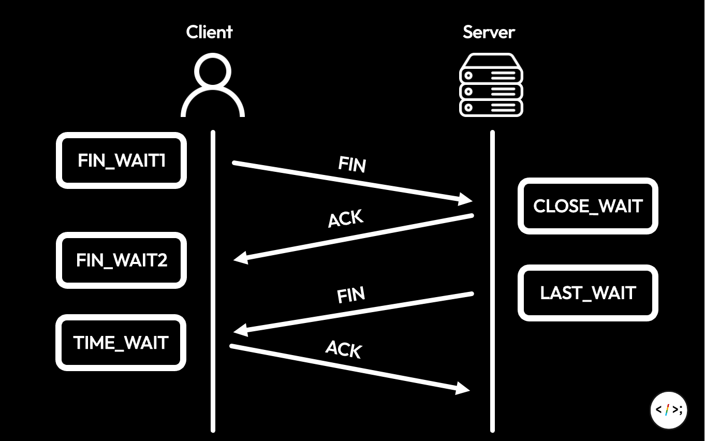

# Proxy와 Timeout, 알기 참 힘든 친구

저희 부서는 사내 k8s Wrapper로 이전하는 과정에서, 예전에 발생하지 않았던 아주 기묘한 이슈가 발생했었습니다.
이 문제는 왜 발생했고, 어떻게 해결했을까요?
(* 의외로 원인 자체는 단??순 했습니다. 다만, 이 과정에서 학습한 내용 자체에 초점을 맞춰서 설명할 것이라, 내용은 상당히 깁니다.)

## 문제 제기
컴포넌트의 구성을 설명하기느 어렵지만, 단순하게 문제 제기를 위해 아주 간략하게 구조를 요약하면 아래와 같습니다.
```
(Container 환경) -> (Proxy) -> (VM 환경)
```

VM 환경의 컴포넌트를 호출할 때, Proxy를 통해서 호출하는 구조라고 보면 될 것 같습니다.
(이는 트래킹의 용도도 있지만, Proxy로 나가는 IP를 Container 와 상관 없이 고정하여 ACL을 안정적으로 설정하기 위한 목적도 있습니다.)

그런데 아주 적은 확률로 HTTP 503 (SERVICE_UNAVAILABLE) 에러가 발생하는 것이 확인되었습니다.

어떠한 에러 메시지나 상세 설명 없이 503 하나만 툭 던져지다보니, 이 원인을 파악하는 것이 매우 어려웠습니다. (특히, 회사에서 제공하는 k8s Wrapper의 특성상, **저희가 내부 구조 및 설정을 확인할 수 없었기에** 더욱 어려웠습니다.)

자, 우선 문제를 하나씩 분석해 봅시다.

## HTTP 503
HTTP 503의 설명을 잠시 봅시다.
> 하이퍼텍스트 전송 프로토콜(HTTP) `503 Service Unavailable` 서버 에러 응답 코드는 서버가 요청을 처리할 준비가 되지 않은 것을 의미합니다.
> 
> 흔하게는 서버가 점검을 위해 다운되거나 과부하 때문에 발생합니다. 이 응답은 일시적인 상황을 위해 사용되어야 하며, Retry-After HTTP 헤더는 가능하다면 서비스 복구를 위한 예상 시간을 포함해야 합니다.

간단하게 요약하면, "서버의 잘못" 이라고 할 수 있습니다.
여기서 Container 환경의 app은 서버이긴 하지만, 현재 API 요청 구조의 특성상 클라이언트라고 할 수 있기 때문에, 저희는 "VM 쪽 네트워크 잘못인가?" 라고 1차적으로 의심해 볼 수 있었습니다.

VM은 앞단에 Nginx를 두고 있는 서버이었기에, 1차적으로 Nginx의 설정이 잘못되었나 판단을 해 볼 수 있을 것 같았습니다.

그런데... Nginx의 access.log (접속 이력 로그) 에 해당 503이 발생한 로그가 전혀 찍혀있지 않았습니다. 엇, Nginx의 문제가 아니었던걸까요?

다양한 시행착오와 수많은 문의 끝에, **keepalive_timeout** 설정이 범인임을 알게 되었습니다.

## TCP Keepalive

우선, TCP Keepalive를 살펴 보기 전, 연결을 해제하는 과정을 잠깐 살펴보겠습니다.



TIME_WAIT 소켓의 주 목적이 중요한데, **연결 해제 패킷 전송 시 패킷이 손실되어도 안정적으로 해제할 수 있도록 하고, 잔여 데이터를 전송 받기 위함** 입니다.

좋긴 하지만, 결국 TIME_WAIT 소켓의 생존 시간이 1분이기 때문에 연결을 자주 맺고 끊는 입장에선 다소 거슬릴 수 있습니다. (+ 불필요하게 3 Way handshake 하기도 싫을 수 있고)

이 때문에, TCP Keepalive 를 사용하여 연결을 끊지 않고 계속해서 유지하려고 시도하는 것 입니다. (Connection Pool의 수많은 연결들이 대부분 이러한 Keepalive를 사용하고 있습니다.)

이렇게 들으면 거창해보이지만, 그냥 정해진 시간마다 확인 패킷을 보내는겁니다.

### TCP Keepalive vs HTTP Keepalive
다들 은근히 헷갈리는 부분이라 한 번 언급 하고 넘어가도록 하겠습니다.
- TCP Keepalive: 정해진 텀 마다 ACK 패킷을 보내 세션 테이블을 유지한다.
- HTTP Keepalive: 설정된 기간 까지 연결을 유지하다가, 직접 연결을 끊어버린다.

즉, 이름은 똑같지만 개념 자체는 많이 다른 편 입니다. TCP Keepalive는 **지속적 연결**에 초점을 맞추고 있다면, HTTP Keepalive는 **정해진 시간 만큼의 확실한 연결**에 초점을 맞춰져 있다고 보면 됩니다.

## Proxy와 Timeout
직접 서버로 요청을 보내는게 아닌, 로드밸런서 등을 거쳐서 요청을 보내는 케이스를 생각해 봅시다.
- 클라이언트는 서버로 요청을 하기 위해, 주어진 IP로 요청을 보낸다.
- IP는 LB를 향해 있고, LB를 통해 요청을 보낸다.
- LB는 요청을 받아 서버로 전달한다.

그렇다면, 서버의 응답은 어떻게 전달되어야 할까요?
- 서버 -> 로드밸런서 -> 클라이언트?
- 아니면, 서버 -> 클라이언트?

당연하겠지만, 일반적으로 요청보다는 응답의 크기가 훨씬 큽니다. (사용자는 HTTP 요청 하나만 보내지만, 응답은 거대한 이미지라고 가정 해보면, 답은 뻔하죠.)

과연 로드밸런서가 여러 서버에서 전달되는 거대한 응답들을 다 받아야 할까요? 그렇다면, 트래픽이 걱정된다고 로드밸런서를 설치한 이유가 아예 없다고 봐도 무방합니다.

그렇기에, 생각보다 많은 케이스에서 요청은 클라이언트 -> LB -> 서버로 향하지만, 응답은 서버 -> 클라이언트 로 전달되는 경우가 많고, 우리는 이를 DSR (Direct Server Routing) 이라고 부릅니다.

자, 이제부터 발생할 수 있는 문제를 알아봅시다. (생각보다 헷갈리고 어려우니 빡집중!)

- 로드밸런서나 프록시는 일반적으로 반복되는 사용자의 요청을 동일한 서버로 매핑하려고 합니다.
  - 그렇기에, 세션 테이블을 만들어 클라이언트와 서버간의 매핑을 저장하고 있습니다.
- 이는 Idle timeout으로 관리되며, 해당 시간 동안 클라이언트에게 요청이 오지 않을 시 테이블의 정보를 제거합니다.
- 앞에서 우리는 응답이 서버 -> 클라이언트에게 전달된다고 했었죠?
  - TCP 3-Way Handshake가 진행되면, 처음에는 클라이언트 -> LB -> 서버와 같은 식으로 SYN이 보내지고, 이후 서버 -> 클라이언트 식으로 SYN + ACK 가 생성될 것 입니다.
- TCP Keepalive 에 의해, 클라이언트와 서버가 Handshake가 이루어지면 연결이 끊어지지 않고 지속적으로 유지됩니다.
- 이 과정에서, TCP Keepalive 에 의해 연결이 끊어지지 않았는데 IdleTimeout에 도달해서 세션 테이블 데이터가 제거되었다면??
  - 클라이언트는 해당 서버 접속이 필요해서 요청을 보냈는데, LB의 세션 테이블에는 데이터가 존재하지 않아 새롭게 매핑을 진행합니다.
  - 이 때, 사실상 랜덤으로 목적지 서버가 결정되므로, 상황에 따라 처음 연결한 서버가 아닌 다른 서버로 매핑될 수 있습니다.
  - 이 경우, 할당된 서버는 Handshake 없이 갑자기 요청이 들어왔으므로 요청을 거부하고, (이에 따라 RST 패킷 전송) 결국 새롭게 연결을 생성해야 합니다.
- 이 모든 과정이 애플리케이션 입장에선 Connection 수립 과정이므로, 클라이언트는 Connection Timeout을 띄우고 오류를 발생시킬 수 있습니다.
- 그렇기 때문에, 중간에 프록시를 띄우거나 LB를 띄우는 경우, 클라이언트나 프록시/LB 의 timeout 설정을 다소 신중하게 잡을 필요가 있습니다.

nginx 는 TCP keepalive, HTTP keepalive 에 대한 설정을 제공하고 있고, 대상 서버가 nginx를 사용하고 있다면, 일차적으로 해당 설정 변경을 고려해야 합니다.
다양한 MQ (RabbitMQ, Kafka 등) 또한 기본적으로 TCP Keepalive 에 대한 설정을 포함하고 있으니, 필요하다면 해당 설정값을 변경 할 수 있습니다.

결국, 프록시나 로드밸런서 등을 중간에 담으로써 통신의 매개체가 발생하게 된다면, 편할지는 모르겠지만 관리하는 입장에선 오히려 난이도가 올라간다고 할 수 있습니다.
특히나 timeout 같은 경우는 단순히 어딘가를 길게 잡는다고 해결되는 것이 아니라, 문제 상황에 맞춰서 어떤 컴포넌트의 timeout을 더 길게 할지 고려해야 합니다.
저희 또한 그랬고요.

## 다시 문제로
결론적으로, 저희가 볼 수 없었던 프록시의 keepalive 시간은 **300초** 였고, VM의 keepalive 시간은 **10초** 였습니다.
즉, 다음과 같은 일이 발생할 수 있는데요.
- 프록시는 300초의 시간 동안 테이블을 유지하므로, 요청을 끊지 않고 유지하려고 함.
- 다만 VM은 10초 경과 후 연결을 유지하지 않음.
- Container가 요청을 보냈을 때, 프록시는 저장하고 있는 연결 정보를 그대로 재사용
- 이 때, VM 입장에선 Handshake 요청 없이 갑작스럽게 값이 들어온 것이므로 RST 패킷을 전송함.
- 이 패킷을 받은 Container는 이를 503으로 인식함

따라서, VM의 nginx 설정을 뜯어고쳐 keepalive 시간을 301초로 맞춰줌으로써 문제가 해결되었습니다.

## 결론
개인적으로 이 문제를 해결하면서 크게 두 가지를 깨달았는데요,
- Blackbox가 편하고 좋지만, 오히려 이런 Troubleshooting 관점에선 더 난해해진다는 것을 느꼈습니다. 결국 사용 관점에서의 편의성을 위해 blackbox 형식의 도구를 사용하더라도, 내부적인 구조에 대한 이해가 필요하다는 것도 느꼈습니다.
- 정말 네트워크 적인 이슈는 모르면 다친다...
